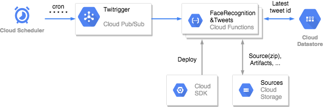
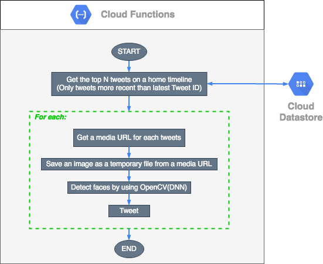

# Face Detection and Tweets on the GCP Serverless Architecture

## Topics

- Getting a Twitter home timeline by using the Twitter API (by Tweepy)
- Face detection using OpenCV (DNN)
- GCP serverless architecture
  - Cloud Scheduler, Pub/Sub, Cloud Functions, GCS, Datastore, Cloud SDK

---

## Architecture



---

## Processing flow



---

## Usage (Run in the GCP)

1. **Make a config.py**

    ```Python
    CONSUMER_KEY = "<your-twitter-consumer-key>"
    CONSUMER_SECRET = "<your-twitter-consumer-secret>"
    ACCESS_TOKEN = "<your-twitter-access-token>"
    ACCESS_TOKEN_SECRET = "<your-twitter-access-token-secret>"
    ```

1. **Install the latest Cloud SDK**

    **Ref:**
    [Quickstart: Getting started with Cloud SDK](https://cloud.google.com/sdk/docs/quickstart)

1. **Make a zip file**

    ```console
    $ zip -r [FILE_NAME].zip *
    ```

1. **Make a bucket in GCS**

    **Example:**

    ```console
    $ gsutil mb -p [GCP_PROJECT_ID] -l US-CENTRAL1 gs://[BUCKET_NAME]
    ```

    Ref:
    [Creating storage buckets](https://cloud.google.com/storage/docs/creating-buckets)

1. **Upload a zip to GCS**

    **Example:**

    ```console
    $ gsutil cp [FILE_NAME].zip gs://[BUCKET_NAME]
    ```

    Ref:
    [Uploading objects](https://cloud.google.com/storage/docs/uploading-objects)

1. **Deploy to Cloud Functinos**

    **Example:**

    ```console
    $ gcloud functions deploy [FUNCTION_NAME] \
      --source=gs://[BUCKET_NAME]/[FILE_NAME].zip \
      --stage-bucket=[BUCKET_NAME] \
      --trigger-topic=[Pub/Sub_TOPIC_NAME] \
      --memory=256MB \
      --runtime=python37 \
      --region=us-central1 \
      --project=[GCP_PROJECT_ID] \
      --entry-point=main
    ```

    If the Pub/Sub_TOPIC_NAME doesn't exist, it is created during deployment.

    Ref: 
    [Google Cloud Pub/Sub Triggers](https://cloud.google.com/functions/docs/calling/pubsub), 
    [Deploying from Your Local Machine](https://cloud.google.com/functions/docs/deploying/filesystem)

1. **Create a Cloud Scheduler job**

    **Ref:**

    [Using Pub/Sub to trigger a Cloud Function - Create a Cloud Scheduler job](https://cloud.google.com/scheduler/docs/tut-pub-sub#create_a_job)

    

1. **Done**

    After receiving the Cloud Scheduler job, get tweets, detect faces, and do tweets every minute (cron * * * * *).


## Usage (Run locally)

1. **Make a config.py**

    ```Python
    CONSUMER_KEY = "<your-twitter-consumer-key>"
    CONSUMER_SECRET = "<your-twitter-consumer-secret>"
    ACCESS_TOKEN = "<your-twitter-access-token>"
    ACCESS_TOKEN_SECRET = "<your-twitter-access-token-secret>"

1. **Install python packages**

    ```console
    $ pip install -r requirements.txt
    ```

1. **Set up authentication for GCP**

    Create a service account for Cloud Datastore.

    **Ref:**
    [Datastore mode Client Libraries - Setting up authentication](https://cloud.google.com/datastore/docs/reference/libraries#setting_up_authentication)

1. **Run**

    ```console
    $ python main.py
    ```

    Get tweets, detect faces, and do tweets.
